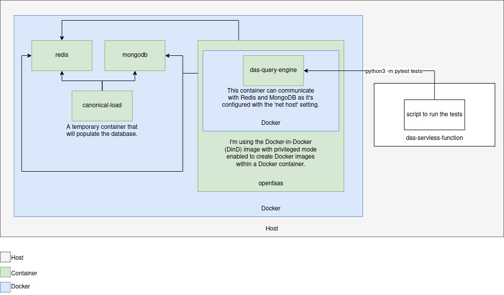

# Documentation on DAS Serverless Functions

Serverless Functions represent an innovative approach to implementing and executing code in cloud computing environments. This architecture enables developers to create and execute code fragments in a granular manner, without concerns about the underlying infrastructure.

## Pre-Commit Setup

Before pushing your changes, it's recommended to set up pre-commit to run automated tests locally. Run the following command (needs to be done once):

```bash
pre-commit install
```

## OpenFaaS: Simplifying Serverless Functions Management

OpenFaaS, or Open Functions as a Service, is an open-source platform simplifying the entire life cycle of Serverless Functions. It provides a highly flexible and scalable framework for developing and executing functions in both cloud environments and local infrastructures.

## Running an OpenFaaS Function Locally

### Requirements

- Docker
- Docker Compose

### Architecture



The project architecture consists of:

- **Redis and MongoDB**: Databases used by the application.
- **Canonical Load**: Temporary container to load initial data into Redis and MongoDB databases.
- **OpenFaaS**: Primary container hosting the OpenFaaS function, equipped with the faas-cli.
- **Function Container**: Internal container within OpenFaaS, responsible for handling and processing requests.
- **das-query-engine**: Operates on the same network as the 'openfaas' container.
- **Port 8080**: Exposed for connection to the host machine.

### Step-by-Step Guide

1. **Cloning the Project**

   Clone the project repository to your local environment.

   ```bash
   git clone <REPOSITORY_URL>
   cd <PROJECT_NAME>
   ```

2. **Creating the Environment File**

   Create an environment file at the root of the project based on `.env.example`. This file contains the necessary environment variables for the project to function.

   ```bash
   cp .env.example .env
   ```

3. **Starting the Environment**

   Execute the following command at the root of the project to start the required services:

   ```bash
   make serve
   ```

   This will start containers for Redis, MongoDB, and a temporary container named 'canonical-load'. The latter is used to load initial data into the Redis and MongoDB databases. After its execution, a container named 'openfaas' will start, which includes the faas-cli.

4. **Executing the Function**

   Once the environment is initialized, you can execute the OpenFaaS function. The function resides within a container inside the 'openfaas' container, configured to handle requests.

5. **Shutting Down the Environment**

   To shut down the containers and clean up the environment, execute the following command:

   ```bash
   make stop
   ```

### Testing

To run automated tests for the project, use the following script:

```bash
make integration-tests
```

```bash
make unit-tests
```

This script will set up the necessary environment for testing.

### Use the hyperon-das and hyperon-das-atomdb from the host machine

This feature has been implemented to allow developers to test the integration of AtomDB and Query Engine packages locally, even before publishing them on PyPI. This facilitates efficient testing during the development phase.

1. Open the `.env` file at the root of your project.

2. Add the following environment variables, adjusting the paths as necessary:

   ```dotenv
   ATOMDB_PACKAGE_PATH=/path/to/your/atomdb/package
   QUERY_ENGINE_PACKAGE_PATH=/path/to/your/query/engine/package
   ```

   Make sure to replace `/path/to/your/atomdb/package` and `/path/to/your/query/engine/package` with the actual paths of the AtomDB and Query Engine packages on your system.

3. If you prefer to use the latest versions of the AtomDB and Query Engine packages published on PyPI, leave the variables empty:

   ```dotenv
   ATOMDB_PACKAGE_PATH=
   QUERY_ENGINE_PACKAGE_PATH=
   ```

## Obtaining Function Logs in faasd Using the `ctr` Command

To access logs from functions running in faasd, the `ctr` command offers a direct interface with containerd, responsible for managing containers in the system, such as faasd.

### 1. Identifying the Function

The initial step involves identifying the name of the function from which logs are needed. Typically, this name corresponds to the container where the function is active. For instance, let's consider a function named `query-engine`.

### 2. Using the `ctr` Command

Employ the `ctr` command to access logs from the desired function. Here's an example:

```bash
ctr -n openfaas-fn tasks exec --exec-id shell query-engine cat /var/log/das/das-query-engine.log
```

- `-n openfaas-fn`: Specifies the namespace in which the function is being executed in faasd.
- `tasks exec --exec-id shell query-engine`: Executes a command within the `query-engine` function's container.
- `cat /var/log/das/das-query-engine.log`: Command to display the contents of the `das-query-engine.log` log file.

### 3. Viewing the Logs

After executing the command, the logs from the `query-engine` function will display in the terminal. If preferred, it's possible to redirect the output to a local file:

```bash
ctr -n openfaas-fn tasks exec --exec-id shell query-engine cat /var/log/das/das-query-engine.log > logs_query-engine.txt
```

Replace `logs_query-engine.txt` with the desired filename where you want to save the logs.
